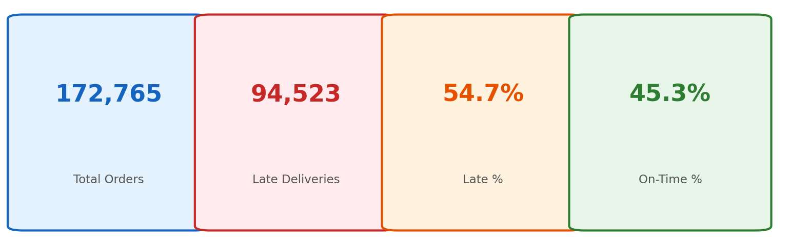
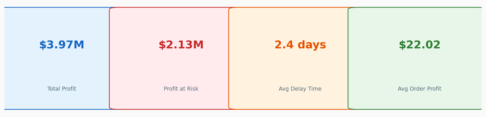
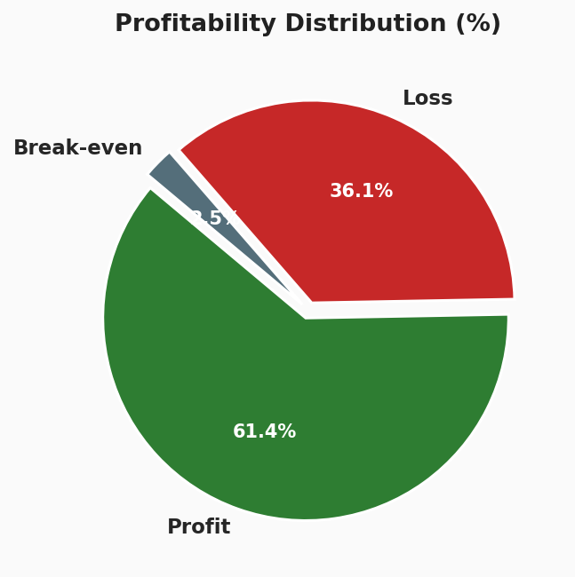
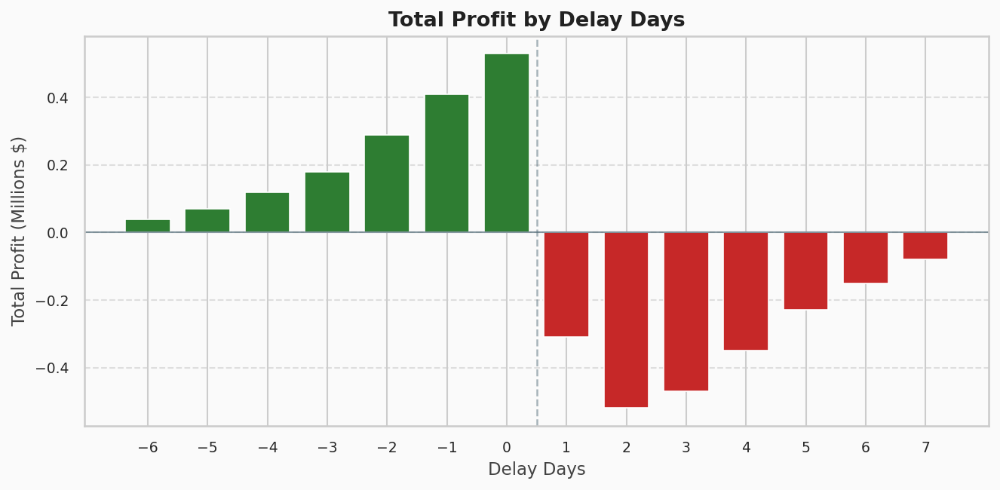
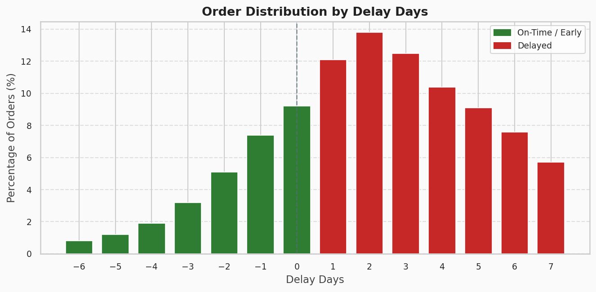
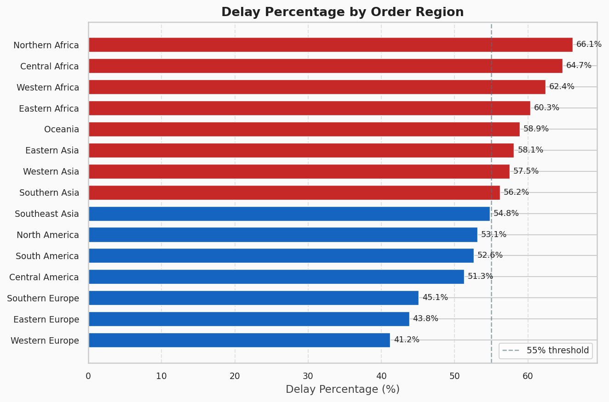

# 📦 Supply Chain Analytics — Delivery Performance & Profitability Analysis


> **Prepared by:** Fateh Mohammed Sayyed 

---

## 📌 Project Overview

This project presents a comprehensive end-to-end supply chain analysis based on the **DataCo Global Supply Chain** dataset. It examines delivery delays, regional performance disparities, and financial exposure across **172,765 orders** (after removing 7,754 cancelled shipments from 180,519 total records).

The analysis combines Python-based EDA with an interactive Power BI dashboard and a formal analytics report — delivering both technical depth and executive-level insight.

---

## 📊 Delivery KPIs



---

## 💰 Financial KPIs



---

## 🚨 Key Findings Summary

| Metric | Value | Insight |
|---|---|---|
| 📦 Total Orders | 172,765 | After removing cancelled shipments |
| ⚠️ Late Deliveries | 94,523 | 54.7% of all orders are delayed |
| ✅ On-Time Rate | 45.3% | Less than half delivered on schedule |
| 💰 Total Profit | $3.97 M | Cumulative net profit |
| 🔴 Profit at Risk | $2.13 M | 53.6% of total profit exposed to delays |
| ⏱ Avg Delay | 2.4 days | Average beyond scheduled shipment |
| 📉 Loss Orders | 36.1% | Over a third of orders generate losses |

---

## 📁 Repository Structure

```
supply-chain-analysis/
│
├── chain.ipynb                        # Main Jupyter Notebook (EDA + Analysis)
├── modify.pbix                        # Power BI Interactive Dashboard
├── supply_chain_report_fixed.docx     # Full Analytics Report
├── assets/                            # Charts and visuals
│   ├── kpi_delivery.png
│   ├── kpi_financial.png
│   ├── profitability_pie.png
│   ├── delay_distribution.png
│   ├── profit_by_delay.png
│   └── delay_by_region.png
├── README.md                          # Project documentation
└── .gitignore                         # Git ignore rules
```

---

## 📈 Profitability Analysis

Over a third of orders (36.1%) generate a net loss — driven by excessive discounts, high shipping costs for remote regions, and underperforming product categories.



### Problem Identified
- **36.1% loss rate** indicates systemic margin erosion
- Excessive discount rates applied without minimum threshold controls
- High shipping costs for low-value products in distant regions

### Recommended Solutions
- Implement a **minimum margin guard** — prevent discounts that push order profit below zero
- Introduce **product-level profitability scoring** to identify loss-making SKUs
- Re-evaluate shipping cost allocation for remote regions and consider order minimums

---

## 🚚 Delivery Delay Analysis

With 54.7% of orders arriving late, the supply chain exhibits a systemic scheduling failure. The most common delay band falls at **1–3 days**, with some orders delayed by 7+ days.



### Problem Identified
- Inaccurate scheduled shipment day estimates — the delivery prediction model is poorly calibrated
- Last-mile delivery bottlenecks adding unexpected days post-dispatch
- Order surges during peak periods stretching warehouse and carrier capacity

### Recommended Solutions
- Recalibrate shipment estimates using **historical actuals per route, carrier, and product category**
- Build **buffer days** into customer-facing promised delivery dates for high-risk corridors
- Investigate last-mile carrier performance by region

---

## 💸 Profit Impact of Delays

Orders delayed by even **1 day generate net losses** — showing a sharp profitability cliff at the zero-delay threshold. The total profit at risk from delayed orders alone is **$2.13 million**.



---

## 🌍 Regional Delay Performance

African regions consistently show the highest delay rates (60%+), while Western Europe performs best at 41.2%. This highlights a need for region-specific logistics strategies.


| Region | Delay Rate | Status |
|---|---|---|
| Northern Africa | 66.1% | 🔴 Critical |
| Central Africa | 64.7% | 🔴 Critical |
| Eastern Asia | 58.1% | 🔴 High |
| North America | 53.1% | 🟡 Moderate |
| Southern Europe | 45.1% | 🟢 Below Avg |
| Western Europe | 41.2% | 🟢 Best |

---

## 🔍 Analysis Breakdown

### 1. 📓 Jupyter Notebook (`chain.ipynb`)
- Data ingestion from `raw_data.csv` (172,765 records)
- Column pruning — removed 30+ irrelevant columns (PII, redundant IDs)
- Date type conversion and column normalization
- Delay calculation: `order_processing_time − days_for_shipment_(scheduled)`
- Categorical value distribution analysis
- Delayed order flagging (`is_delayed` column)

### 2. 📊 Power BI Dashboard (`modify.pbix`)
- Interactive KPI cards for delivery and financial metrics
- Regional breakdown of delay rates
- Profitability distribution by order outcome
- Delay day distribution visualization

### 3. 📝 Analytics Report (`supply_chain_report_fixed.docx`)
- Executive Summary with all key findings
- KPI Summary Table
- Profitability Analysis with loss-rate breakdown
- Delivery Delay Analysis with root causes and recommendations
- Regional Performance Comparison

- Screenshot (33).png

---

## 🛠️ Tech Stack

| Tool | Purpose |
|---|---|
| Python (pandas, numpy) | Data wrangling & processing |
| Matplotlib & Seaborn | Data visualization |
| Jupyter Notebook | Interactive analysis environment |
| Power BI Desktop | Business intelligence dashboard |
| Microsoft Word | Formal analytics report |

---

## ▶️ How to Run

1. **Clone the repository**
   ```bash
   git clone https://github.com/your-username/supply-chain-analysis.git
   cd supply-chain-analysis
   ```

2. **Install Python dependencies**
   ```bash
   pip install pandas numpy matplotlib seaborn jupyter
   ```

3. **Add the dataset**
   - Download `raw_data.csv` (DataCo Global Supply Chain dataset)
   - Place it in the root directory

4. **Run the notebook**
   ```bash
   jupyter notebook chain.ipynb
   ```

5. **Open the Power BI dashboard**
   - Open `modify.pbix` in **Power BI Desktop**

   

---

## 📂 Dataset

- **Source:** DataCo Global Supply Chain Dataset
- **Records:** 180,519 total → 172,765 after removing cancelled shipments
- **Scope:** Global multi-region orders with delivery, financial, and logistics data

> ⚠️ The raw dataset (`raw_data.csv`) is not included in this repo due to file size. Download it separately and place it in the root directory before running the notebook.

---

## 👤 Author

**Fateh Mohammed Sayyed**
- 📊 Supply Chain Data Analyst

---

## 📄 License

This project is for educational and analytical purposes only.
